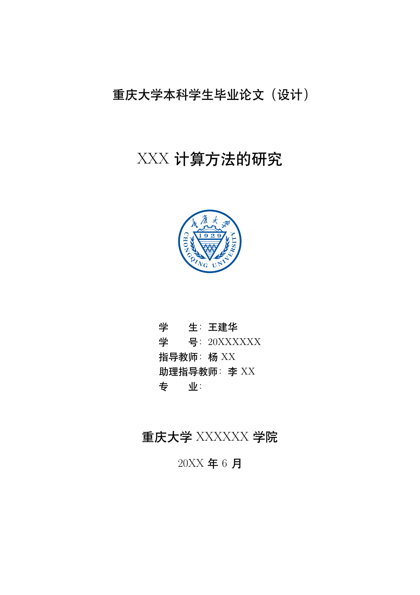
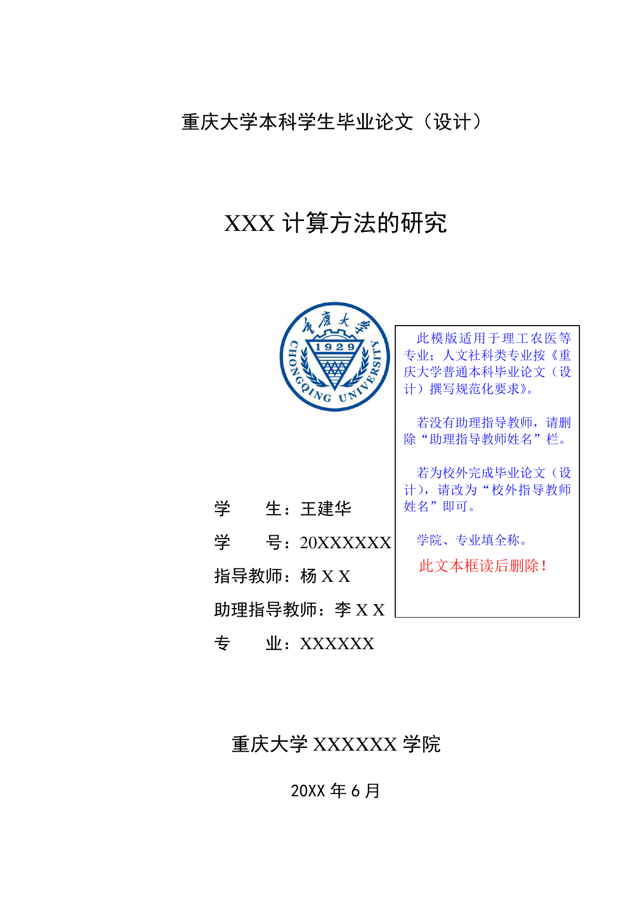
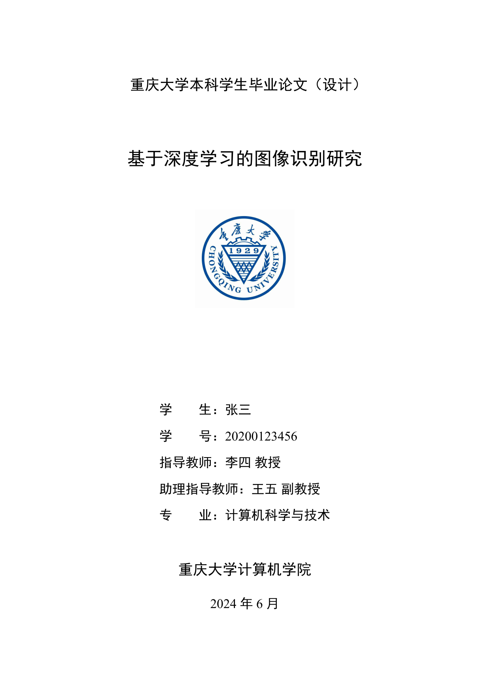
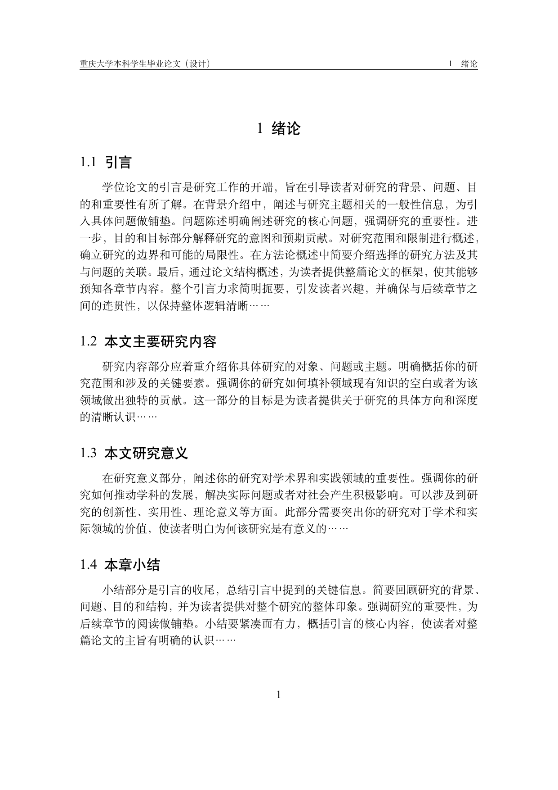
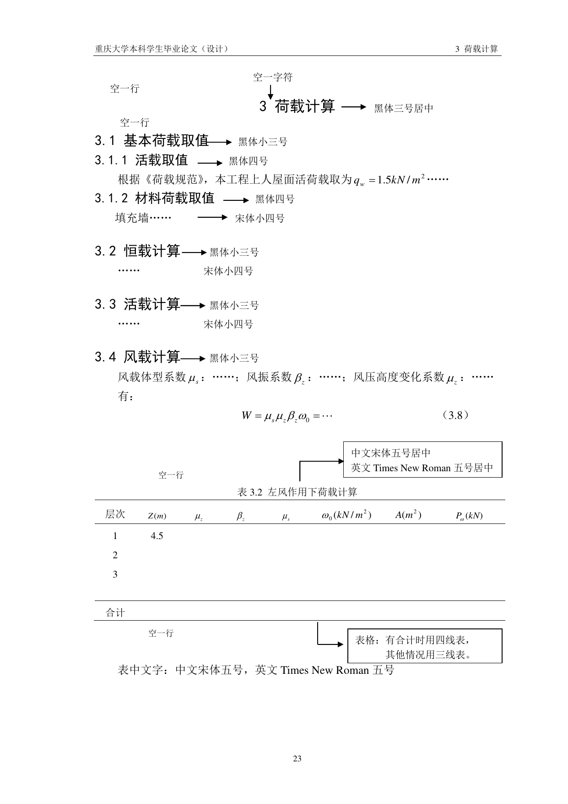
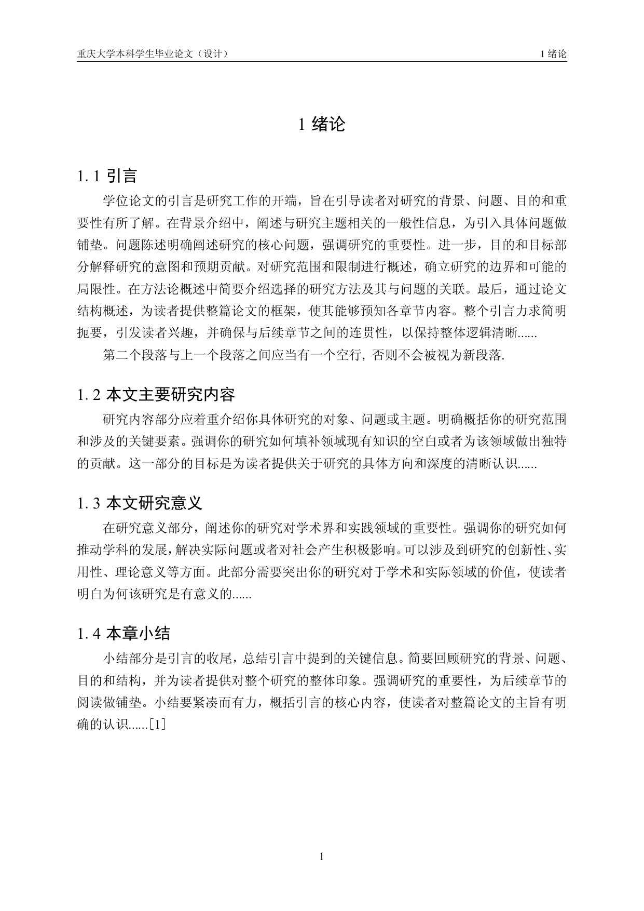

# 重庆大学本科生毕业论文 Typst 模板

本项目为重庆大学本科生毕业论文的 Typst 模板, 基于重庆大学本科生毕业论文 LaTeX 模板和Word 模板制作, 后续可能会陆续添加对研究生和博士生毕业论文的支持.

## 效果
### 首页
| Latex  | Word | Typst |
| ------------- | ------------- | ------------- | 
|   |   |  |

   从模板直接编译得到的首页封面效果.

### 正文
| Latex | Word | Typst | 
| ------------- | ------------- | ------------- | 
|  |  |  |


## 简介

Typst 是一种新型的排版系统，相比于 LaTeX，它具有以下优势：

1. 编译速度快：增量编译功能使修改后能在一秒内生成 PDF 文件
2. 环境搭建简单：原生支持中日韩等非拉丁语言，无需大量配置
3. 语法友好：上手难度低，源码可读性高
4. 功能强大：支持各种学术排版需求

## 目录结构

```
CQU-typst-template/
├── assets/            # 图片等资源文件
├── pages/             # 论文各部分页面模板
│   ├── abstract-en.typ    # 英文摘要
│   ├── abstract-zh.typ    # 中文摘要
│   ├── acknowledgement.typ # 致谢
│   ├── appendix.typ       # 附录
│   ├── cover-en.typ       # 英文封面
│   ├── cover-zh.typ       # 中文封面
│   ├── declaration.typ    # 原创性声明
│   ├── references.typ     # 参考文献
│   └── toc.typ            # 目录
├── utilities/         # 工具函数
│   ├── bib-cite.typ      # 引用工具
│   ├── indent-funs.typ   # 缩进工具
│   ├── set-figure.typ    # 图表设置
│   ├── set-heading.typ   # 标题设置
│   ├── set-numbering.typ # 编号设置
│   └── three-line-table.typ # 三线表工具
├── variable/          # 变量定义
│   └── cqu-variable.typ  # CQU 模板变量
├── cqu-template.typ   # 主模板文件
├── sample.typ         # 示例文件
└── README.md          # 说明文档
```

## 使用方法

1. 安装 Typst：
   - 访问 [Typst 官网](https://typst.app/) 或使用命令行工具安装

2. 使用模板：
   - 复制 `sample.typ` 并重命名为你的论文文件名
   - 修改文件中的个人信息和论文内容
   - 使用 Typst 编译生成 PDF

或

1. 安装 vscode

2. 安装 Tinymist Typst, Typst Math, Typst LSP 三个插件, 第一个必装

3. 享受 Typst 轻快的体验

## 模板参数

在使用模板时，需要设置以下参数：

```typst
#show: project.with(
  title: "论文中文标题",
  title_en: "Thesis Title in English",
  author: "作者姓名",
  author_en: "Author Name",
  student_id: "学号",
  supervisor: "指导教师",
  supervisor_en: "Supervisor",
  assist_supervisor: "助理指导教师", // 可选
  assist_supervisor_en: "Assistant Supervisor", // 可选
  major: "专业",
  major_en: "Major",
  department: "学院",
  department_en: "Department",
  double: true, // 是否双面打印
  gutter: true, // 装订线, 具体长度可在变量中修改
  date: (2024, 6), // 年月
  abstract_zh: [...], // 中文摘要内容
  abstract_en: [...], // 英文摘要内容
  keywords_zh: ("关键词1", "关键词2", "关键词3"), // 中文关键词
  keywords_en: ("Keyword 1", "Keyword 2", "Keyword 3"), // 英文关键词
  bibliography_file: "references.bib", // 可选，参考文献文件
)
```

## 引用格式
三种引用格式, 放置在bib文件夹下: 
- gb-t-7714-2015-numeric (默认)
- gb-t-7714-2015-numeric-bilingual
- gb-t-7714-2015-numeric-bilingual-no-uppercase-no-url-doi

如果需要其他格式, 可以到https://zotero-chinese.com/styles/ 下载, 并且在`pages/references.typ`中修改.

```bash
bibliography(
    style: "../bib/gb-t-7714-2015-numeric.csl",
    title: none,
)
```

目前参考文献为英文格式, 如果想使用中文, 请修改对应的字体 语言.
Typst目前不支持CSL-M, 无法中英文参考文献混用, 并且有些文献类型不支持(如`incollection`), 有一些解决方法但需要自己探索. 目前模板采用了来自NJU的替换法.

可以参考以下链接: 

https://github.com/nju-lug/modern-nju-thesis/issues/3

## 页眉和页脚

本模板自动为文档添加页眉和页脚：

1. **页眉**：包含重庆大学标志和右侧的论文标题与当前章节标题
2. **页脚**：居中显示页码
3. **装订线**：左侧添加装订线

页眉和页脚会自动根据文档的不同部分进行调整：

- 封面页不显示页眉和页脚
- 摘要、目录等前置部分使用罗马数字页码（I, II, III...）
- 正文部分使用阿拉伯数字页码（1, 2, 3...）
- 一级标题（章节标题）会自动更新页眉中显示的章节名称

## 注意事项

1. 本模板仅适用于重庆大学本科生毕业论文
2. 模板尽量遵循重庆大学本科生毕业论文格式要求，但可能存在细微差异
3. 使用前请确认最新的学校论文格式要求

### 标题
默认一级标题可出现在任何地方, 如果想做到只出现在奇数页上, 可以在`set-heading.typ`中对相关的代码取消注释. 如果出错, 可以手动使用`#pagebeak(to: "odd", weak: false)` 进行断页.

需要注意的是, 一级标题后紧跟二级标题时做了特殊处理, 二者之间有一行多的正文时间距是正常的, 如果出现了异常, 则可能出现额外的v(1.8em)的间距.

页眉的标题显示格式和TOC中显示的标题样式挂钩, 请使标题只以[]形式包裹, 不要使用任何样式.

## 问题

~~- 页眉不对应~~
~~- SimSun的粗体问题~~
- 细小格式问题
- 断页问题

因为均是模板部分代码的问题, 可以放心使用, 未来更新不会对`sample.typ`做较大的改动, 等待后续修复即可.

## 贡献

欢迎提交 Issue 或 Pull Request 来完善此模板。

## 许可

本项目采用 MIT 许可证。

## 致谢

- 重大Latex模板: https://github.com/nanmu42/CQUThesis
- HUST华中科技大学 Typst模板: https://github.com/nanmu42/CQUThesis
- CSL引用格式文件: https://github.com/zotero-chinese/styles
